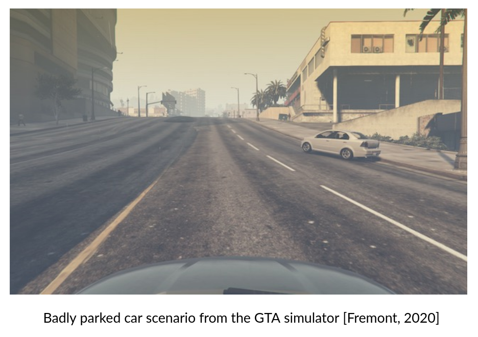
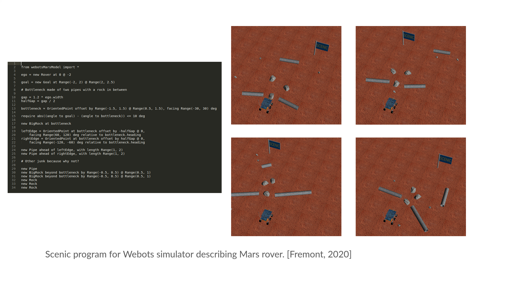
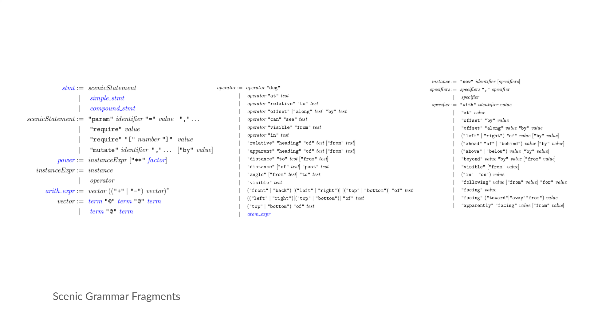

# Rewriting the Scenic Compiler
By Eric Vin

### Scenic Intro
For my CSE 211 final project I decided to try rewriting the compiler for the [Scenic](https://github.com/BerkeleyLearnVerify/Scenic "Scenic") language. It was created by my advisor Daniel Fremont, and I started work on it this past summer. Scenic is a Probablistic Programming Language (PPL) used when designing or analyzing cyber-physical systems. Scenic allows the user to easily describe a distribution of physical *scenarios* using intuitive syntax, and sample then from that distribution. This has numerous applications, but it has primarily been used thus far for the debugging and training of perception based machine learning models. For debugging, Scenic can be used to generate test cases that might be misevaluated by the model. It can also be used to narrow down the cause of the failure once one has been detected by varying the parameters of the scenario. Similarly, Scenic can also be used to help train a model for situations that are difficult or impossible to gather training data for in the real world. In these cases, Scenic can augment the existing test suite to improve performance. One example of both these techniques is [this](https://arxiv.org/abs/2005.07173 "this") case study for an aircraft taxiing system. 

Below is an example of one sample from a Scenario describing a badly parked car in the GTA V simulator.

Scenic varies from many other Domain Specific Languages (DSL) in that it is not primarily focused on optimizing runtime. Instead, Scenic is focused on allowing the user to specify complex geometric relationships and distributions in a quick and human readable fashion. Scenic, like other PPLs, falls in a bit of a strange place for languages as it doesn't really define a set of instructions to be executed. Instead, it defines a distribution over the objects declared to be in a Scenic scenario, which is then sampled. By programming in Scenic, users can avoid having to worry about how to manage all the overhead associated with managing the dependencies of objects, optimizing to minimize sampling rejections, and actually sampling uniformly.

Below is a Scenic program (with new syntax we'll introduce later in this blog post) that describes a Mars rover trying to navigate a bottleneck composed of rock and pipe obstacles. Notice that the program is fairly readable without any former knowledge of Scenic and that all the samples meet the requirements of the program, but are still diverse.

### Scenic Language

Scenic is built on top of Python3, which means that it inherits Python's readable syntax. Furthermore, it allows arbitrary Python to be incorporated into a Scenic program, which means its as expressive as Python. It augments this with a few major language features, the most important of which are summarized below:
- `ego` is a keyword that refers to the object who's view the simulator will reference when visualizing the scenario.
- Multiple built in Scenic objects representing essential geometric concepts. For example, `Point` represents a point in space, `OrientedPoint` represents a Point with a heading, and `Object` represents an OrientedPoint with a length, width and height. Simulators create their own objects inheriting from the built in Scenic objects, usually `Object`.
- Scenic constructs representing distributions of various types, such as discrete, uniform and normal distributions.
- Natural language specifiers and operators that express deep geometric relationships but are easy to write and interpret. For example `Car following Road`, `Bus facing towards Crosswalk`, and `front left bottom of Rock`.
- `require` statements that require a certain boolean formula hold true for every, or a certain percentage, of samples from a scenario.
- `mutate` statements which allow one to introduce noise into Scenic objects that changes their properties intelligently. For example, mutating a Car object might change it's size or model, but would not turn it into a pedestrian.

As a small example program showing how specifiers work, consider a Scenic scenario of two `Cars`, the first in an intersection and the second facing the first. Furthermore assume we would like to be in the perspective of the second car:

`car1 = Car on visible Intersection`
`ego = Car facing car1`

### Original Scenic Compiler Overview

All these features combined with what you can do in native Python make Scenic really intuitive to use, but consequently make compiling it kind of a nightmare. The current version of the Scenic compiler piggybacks on the Python tokenizer and parser, making some clever steps around each to ensure Scenic is parsed correctly. Most of the Scenic code is implemented as Python, so the parser must translate the scenic program into the semantically equivalent Python program and extract the scenario from the resulting namespace. The stages of the compiler are described at a high level below.

**Original Scenic Compiler Stages**
1. Tokenize Scenic input using Python tokenizer
2. Translate token stream to a Python token stream with equivalent syntactical meaning
3. Parse token stream using Python parser
4. Perform tree surgery on resulting Python AST, to transform it into a Python AST with semantics equivalent to the original Scenic program.
5. Evaluate Python program and extract resulting Scenic objects and associated dependencies. Format as a Scenic scenario that can be sampled and return the scenario.

This definitely works, as Scenic is functional and runs very well overall, but there are a few issues with this approach. For one thing adding to or changing the grammar in significant ways is pretty painful, as the token translation and surgery is pretty hard coded. On top of that, the actual translations needed to ensure that the Scenic syntax doesn't clash with Python syntax but that we still get the right semantics at the end, is convoluted to say the least. For example, certain Scenic operators have to be converted to intermediary `raise` statements so that they can be evaluated as statments by the parser, before being converted to the actual semantics later. It's not super easy to debug, hard to document, and to top it all off the error messages don't make a ton of sense sometimes. It's also hard to establish associativity and precedence correctly, and there are other minor issues like not being able to add more infix operators than Python has infix operators. 

### New Scenic Compiler Overview

The way to fix this is straightforward, create a proper compiler from Scenic into the semantically equivalent Python. The nice thing is that most of the Scenic complexity is already taken care of by the associated Python functions, so it's really not too bad to perform the compilation. Ideally, we would like our new compiler to have the structure below.

**New Scenic Compiler Stages**
1. Scenic parser written in ANTLR4
2. Transform Scenic AST to semantically equivalent Python AST
5. Evaluate Python program and extract resulting Scenic objects and associated dependencies. Format as a Scenic scenario that can be sampled and return the scenario.

### New Scenic Compiler Implementation

Implementing the new Scenic compiler had a few major roadblocks. I decided to use ANTLR4 for the grammar, and built off of [this](https://github.com/antlr/grammars-v4/tree/master/python/python3-py "this") preexisting Python parser. I spent quite a few hours combing the Scenic papers and examples, and asking a ton of questions to my advisor, before finally writing out the complete formal grammar for Scenic. This was a really interesting step because we'd never actually formalized a grammar for Scenic in this depth, and so we ended up making some changes to the language to clear up ambiguity or make the language easily parsable, like adding the `new` keyword before Scenic instance creation and adding indentations to certain statement suites to make associativity clearer. Some of the key sections of production rules for Scenic are shown below.

Once the new grammar rules were finalized and tested against a few Scenic tests, all the remained was to crawl the tree and convert the Scenic semantics to Python semantics. This is as simple as converting the node to the appropriate Scenic implementation function and outputting it. It can get a little more complicated with certain Scenic constructs, but the hard part is really getting the parsing correct as pretty much everything but the syntax is checked by the Scenic Python implementation (i.e. coaxing things to the right type, specifier resolution, etc...).

I really enjoyed this project as I felt that not only did I learn a lot about Scenic as a language, but I also felt that sitting down and actually writing out the whole grammar helped us see some issues that were easily overlooked when we were piggybacking off the Python tokenizer and parser. I also have no doubt that any future language changes will be much easier in this new language format, as we can just edit the grammar file and add to the ANTLR visitor used to crawl the tree when adding new syntax.

### Future Work
Going forward I'd definitely like to fully hook up this new front end for the Scenic compiler with the whole pipeline, but we're in the middle of a major rewrite for the Scenic language that complicates this. Once the rewrite is complete, the full implementation seems like the next step. I also want to extend the grammar to cover dynamic scenarios which we currently don't support with the new parser. Following that I'd really like to look into optimizations for the sampling that Scenic does to try to make it more practical for really constrained Scenarios.