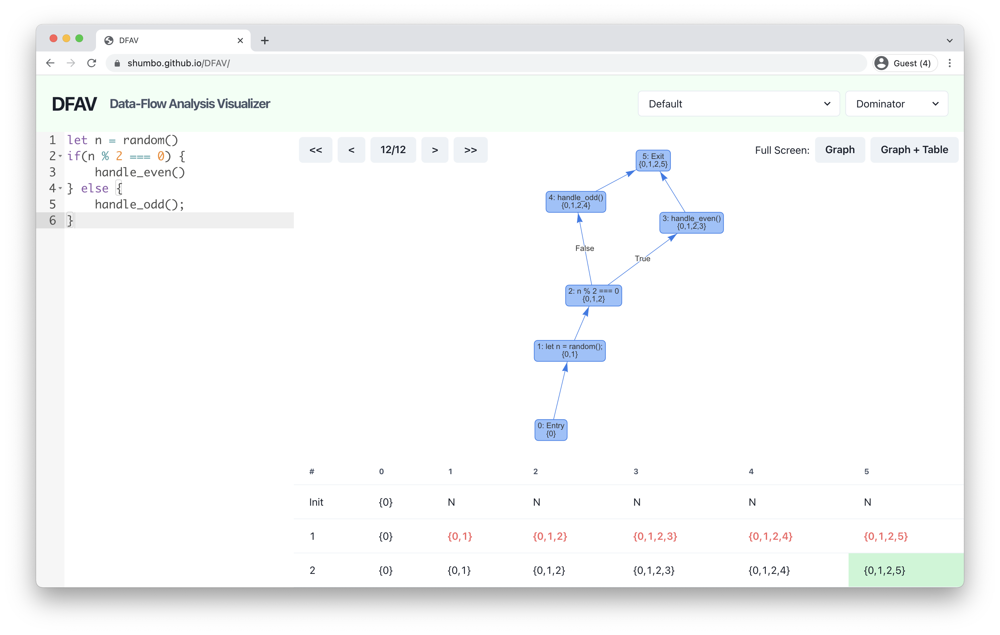
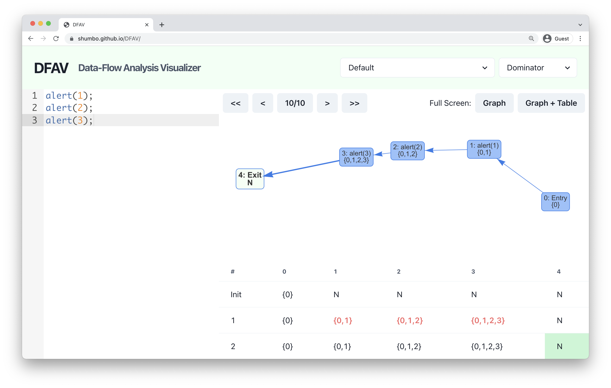
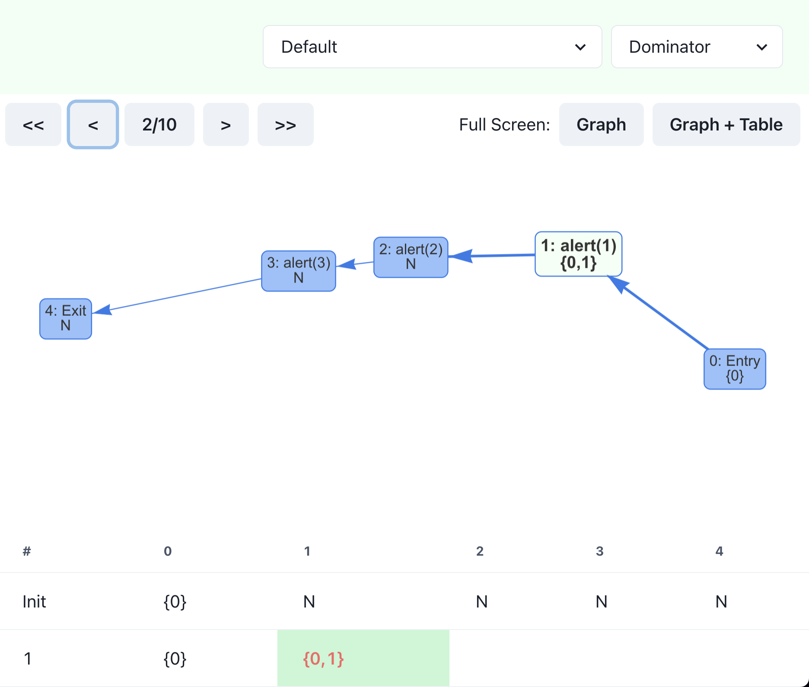
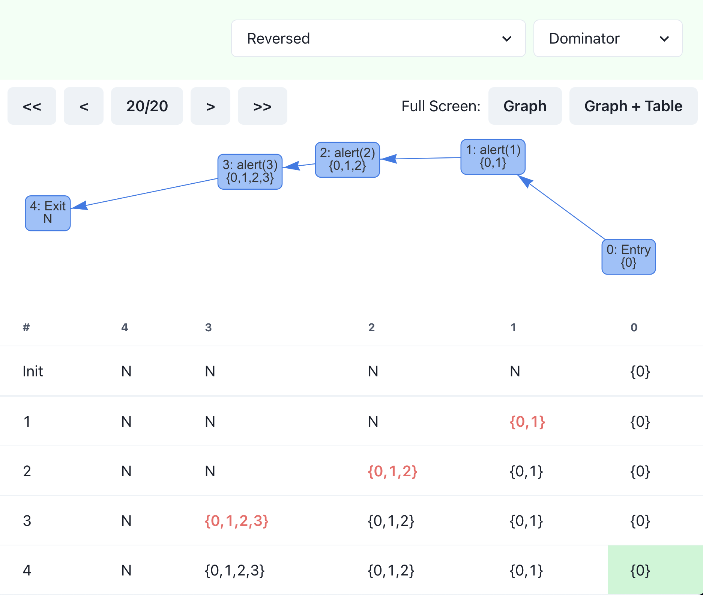
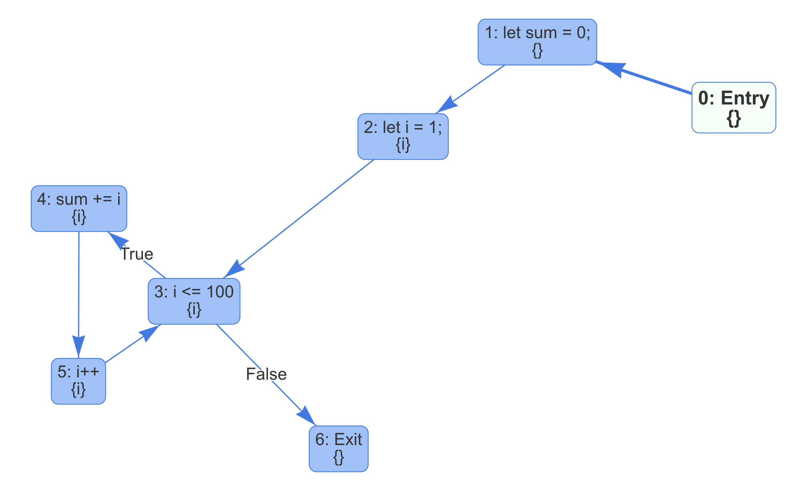
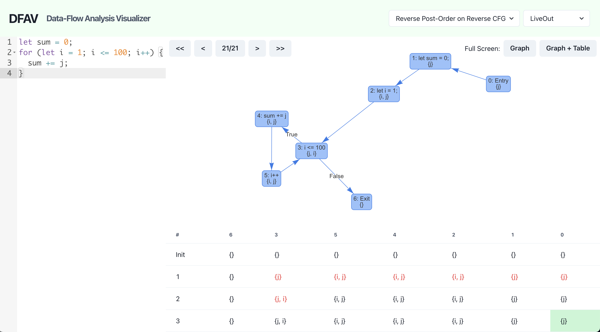
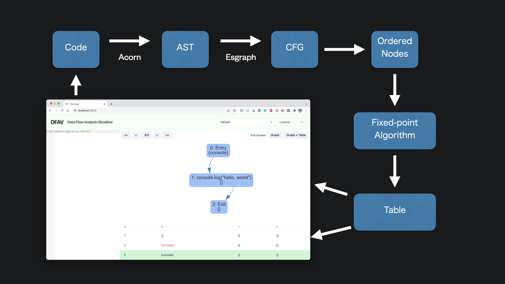

---
# Feel free to add content and custom Front Matter to this file.
# To modify the layout, see https://jekyllrb.com/docs/themes/#overriding-theme-defaults

layout: single
title: Data-Flow Analysis Visualizer
classes: wide
---

<!-- MathJax for displaying mathematical notations -->
<script>
MathJax = {
  tex: {
    inlineMath: [['$', '$'], ['\\(', '\\)']]
  }
};
</script>
<script id="MathJax-script" async
  src="https://cdn.jsdelivr.net/npm/mathjax@3/es5/tex-chtml.js">
</script>



Author: Shun Kashiwa

## Overview

For my final project, I created DFAV: an interactive environment where users can perform data-flow analysis. It can run data-flow analysis in different orders and show how the computation is done step-by-step. DFAV is available at [https://shumbo.github.io/DFAV](https://shumbo.github.io/DFAV), and the source code is available at [shumbo/DFAV](https://github.com/shumbo/DFAV).

## Background & Motivation

In CSE 211, we learned different ways in which compilers could optimize programs. Modern compilers have many layers of optimization; each is responsible for further optimization. Among those optimization techniques, I was interested in static analysis, and especially, **data-flow analysis**.

When a compiler parses the code, it can create a **control-flow graph (CFG)**, which represents all paths that the program might traverse upon its execution. Because it encodes the control flow, it allows us to analyze how the program behaves at run-time.

**Data-flow analysis** is a technique to reason about the run-time flow of values at compile-time. It **solves a set of equations on the CFG** to **check what can happen when the code is executed**.

For example, in class, we saw how to perform **LiveOut** analysis. A variable **v** is **_live_** at point **p** if and only if **there is a path from p to a use of v along which v is not redefined**, and LiveOut(n) is a set of variables that are live on exit from control-flow node n.

A simple way to perform data-flow analysis is to use **iterative fixed-point algorithms**. Because we know the relationship between the nodes on the CFG, we **iteratively perform the same computation** for each node **until we reach the fixed point**.

For instance, the following formula computes the LiveOut set of node:

$$
\displaylines{\operatorname{LiveOut}(n_f) = \emptyset\\\operatorname{LiveOut}(n) = \bigcup_{m \in \text{succ}(n)} \operatorname{UEVar}(m) \cup \left (\operatorname{LiveOut}(m) \cap \overline{\operatorname{VarKill}(m)} \right )}
$$

We keep updating LiveOut sets for each node in some order until we reach the fixed point and no set is updated.

Iterative fixed-point alrogithms are easy to implement. However, **performing them by hand is difficult** because **we need to keep track of many sets**, and **one mistake can lead us to completely different results**. I personally had a hard time breaking down those algorithms and understanding how they work.

Moreover, **the order in which we iterate the node affects how many iterations we need to reach the fixed point**. In general, if the formula checks the node's successors and information flows forward (e.g., dominance), you want to iterate from top to bottom. On the other hand, if the formula checks the node's predecessors and information flows backward (e.g., LiveOut), you want to iterate from bottom to top. Because the graph can contain cycles, it is said that reverse post order should be used, but **it is not clear how the use of those orderings affects the efficiency**.

Therefore, I decided to build an **interactive environment** where **users can run data-flow analysis** to **help them understand those techniques better**.

## Specification

### Platform

In creating DFAV, I chose the **Web** as a platform. You can use Web applications just with a browser, regardless of the device or operation system, which is suitable for my project.

To build a interactive application, I used TypeScript, React, Chakra-UI, etc.

### Input

To run data-flow analysis, we need a program, and DFAV takes **JavaScript** code as input.

I chose JavaScript because it is **one of the most popular programming languages** and has been **widely used** even outside browsers. Moreover, it has a **simple but powerful syntax** which is ideal for describing different control flows and examining how data-flow analysis would work on them.

### Configuration

This project focuses on iterative fixed-point alrogithms. Users can select **mode** and **order** to specify how to perform analysis.

**Mode** specifies which analysis to perform. Currently, **DFAV supports dominance analysis and LiveOut analysis**. As described later, DFAV provides useful functions for implementing iterative fixed-point algorithms, so it should be pretty easy to add modes.

**Order** specifies an order in which the analysis iterates nodes. As mentioned, this affects the performance of the analysis. DFAV supports the following five orders.

- Default...Order in the source code
- Reversed...Reverse order of default
- Post-Order...Order in the Post-Order Traversal
- Reverse Post-Order...Reverse order of Post-Order
- Reverse Post-Order on Reverse CFG

### Analysis

**DFAV shows the execution of the algorithm as a table and a graph**. In the table, each row represents an iteration, each column represents a node, and each cell contains a computed set. We also show the computed set in a control-flow graph.

In addition to the results, **we are also interested in how they are computed**. That's why users can **run analysis step-by-step**. The corresponding cell in the table and node in the graph are highlighted at each step, and users can see how the algorithm derived the set.

## Demo

Let me show you how DFAV works with some examples.

<p class="notice--info">
DFAV is available <a href="https://shumbo.github.io/DFAV" target="_blank">here</a>. Click the link and copy-paste the code and run analysis yourself!
</p>

### Dominator

First, consider the following basic program that has three statements in order. Let's compute the dominance of each node in default order.

```js
alert(1);
alert(2);
alert(3);
```



If you copy-paste the code to the editor on the left and choose the Dominator mode, you will see the computed dominance on the table and the graph. Here, N represents all nodes in the graph, so node 4 is dominated by all nodes, node 3 is dominated by node 1,2,3 and 4, and so on.



Let's go back in step to see how it reached this result. **Step 2 computes the dominance of node 1** by taking the union of the set of its only predecessor (`{0}`) and the node itself (`{1}`). As a result, we obtain `{0, 1}` and update the set, which is highlighted in the screen above. It keeps going, and no changes are made in the second iteration (second row in the table), so the algorithm finishes at step 10.



You can choose a different order and see how it changes the number of steps needed. If you select "reversed," the number doubles, and it requires 20 steps to finish. In the table, you can see that only one cell is changed in each row, which leads to more iterations.

### LiveOut

Similarly, you can perform **LiveOut** analysis. Consider running LiveOut analysis on the following code in Reverse Post-Order on Reverse CFG.

```js
let sum = 0;
for (let i = 1; i <= 100; i++) {
  sum += i;
}
```



Because of the loop, we now have a more complicated control-flow graph. We can see the variable `i` is live at node 2 to 5, which is true.

LiveOut analysis can be used to identify uninitialized variables. Let's say the developer made a typo, and used `j` instead of `i` inside the loop.



Now, the entry node (0) has `j` in its LiveOut set. This means that the variable is accessed before being initialized. Using this result, code editors and compilers can warn developers of potential errors.

You can use most of all JavaScript control flow statements, such as `if`, `while`, `for`, `switch-case`, `continue`, `break`, etc.

## Architecture

The following image describes the architecture of DFAV.



### Abstract Syntax Tree

Given JavaScript code, **DFAV first converts it to an abstract syntax tree (AST)**. Many of the projects in the JavaScript ecosystem follow **[the ESTree spec](https://github.com/estree/estree)** to describe an AST, and DFAV can use any JavaScript parser that is compatible with ESTree.

DFAV currently uses **[Acorn](https://github.com/acornjs/acorn)** to parse the code, but we can easily change it to a different parser. For example, if we use [@babel/parser](https://babeljs.io/docs/en/babel-parser), we'll be able to parse TypeScript and many experimental language proposals.

### Control-Flow Graph

**DFAV then converts an AST to a control-flow graph using [esgraph](https://www.npmjs.com/package/esgraph).** I wanted to write my own AST-to-CFG converter, but it needed a lot of effort, and I did not have enough time before this project was due. While esgraph works fine with the basic syntax, it does not seem to support some of the new syntax (e.g., `for...of` loop), and I wish to rewrite this in the future.

Internally, DFAV converts the esgraph's graph data structure into DFAV's graph data structure. Hence, we can change control-flow graph generation without changing other parts of the code.

### Order

Now that we have a graph, we order its node in a specified order.

### Running Iterative Fixed-Point Algorithm

Given a graph and ordered nodes, DFAV runs an iterative fixed-point algorithm, keeping track of computation history.

```typescript
type Algorithm = (
  graph: Graph<FlowNode>,
  orderedNodes: Node<FlowNode>[],
  helpers: AlgorithmHelpers
) => Map<string, string>[];
```

Internally, an algorithm is a function that takes a graph, ordered nodes, and helper object and returns a table. `AlgorithmHelpers` object provides a useful function `FixedPoint` to implement iterative fixed-point algorithms.

```typescript
type AlgorithmSnapshot = { [id: string]: string[] };
type FixedPoint = (
  initial: AlgorithmSnapshot,
  fn: (node: Node<FlowNode>, state: AlgorithmSnapshot) => string[]
) => AlgorithmSnapshot[];
```

The `FixedPoint` function takes an initial state and a function that performs one set computation. For example, the dominance analysis is implemented as follows.

```typescript
const table = helpers.fixedPoint(initial, (node, state) => {
  const predsDoms = [...graph.predecessors(node.data)].map(
    (x) => state[x.data.id]
  );
  return union([node.data.id], intersection(...predsDoms));
});
```

This is pretty much the same as how we describe the algorithm in a set notation.

$$
\operatorname{Dom}(n) = \{ n \} \cup \left ( \bigcap_{p \in \text{preds}(n)}^{} \operatorname{Dom}(p) \right )
$$

This helper object made it simple to implement the two algorithms, and should makes it easy to add more.

### UEVar and VarKill

To perform LiveOut analysis, for each node, we need to get an upward-exposed variable set (`UEVar`) and set of variables defined in the node (`VarKill`).

To compute those sets, DFAV traverses the AST for each node and finds all identifiers. For each identifier, add the variable to the `VarKill` if it is used on the left-hand side of a variable assignment or variable declaration, and otherwise add it to the `UEVar`.

It seems to work fine, but I'm not sure if my assumption that all identifiers in an AST either reads or writes a variable is true. I want to take a closer look at ESTree and JavaScript syntax to check my assumption is reasonable.

### Showing Graph & Table

Finally, DFAV shows the graph and table.

DFAV uses [vis.js](https://visjs.org/) to render graphs. While it works fine, the layout calculation sometimes places nodes too close or distant to each other, and I am thinking about how I can improve it.

## Conclusion & Future Work

I implemented all the basic features that I wanted to when I first learned about data-flow analysis. Using DFAV, I was able to deepen my understanding of how different orderings affect the algorithm's efficiency by comparing orders in the same graph just by changing the option.

However, there are many ways in which DFAV can be improved. As mentioned, it currently implements only two algorithms, and I want to visualize more. The graph needs a better layout to analyze complicated control-flow graphs. I wish to work on these improvements in the future.

Finally, DFAV is open source. If you find any bugs or have feature requests, feel free to create an issue at [https://github.com/shumbo/DFAV](https://github.com/shumbo/DFAV)!
