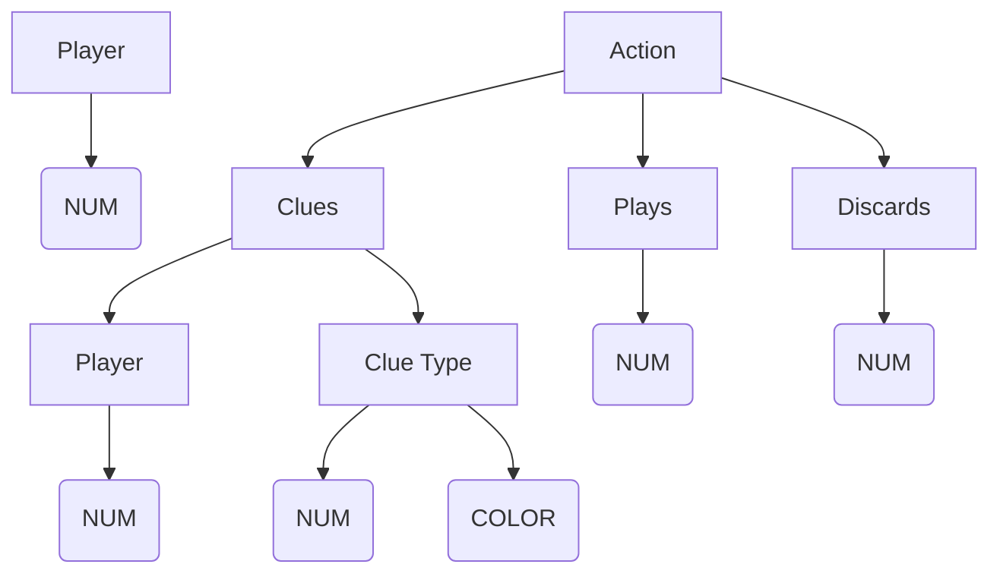

# Hanabi Game Compiler

## Hanabi Background
Hanabi is a 2-6 player collaborative card game that is commonly played [online](https://hanab.live). 
The deck is comprised of cards colored Red, Yellow, Green, Blue, or Purple, and numbered 1-5. 
The goal of the game is to create a stack of each color played in ascending number order. Everyone is on the same team, so all players are working together to accomplish this goal. The team either loses together, or wins together.

The cards can be played in any order between piles, as long as each card is played in order with respect to its own pile. (ie, Players can play Blue 3 and then Red 1, but not Red 2 followed by Red 1). 

The key element of the game is that every player can view everyone else's cards. However, the catch is that they can't see the cards in their own hands. If the game were played in person, it would involve the players sitting in a circle with their cards fanned out so that they can see the backs of the cards in their hand. This way, they can see everyone's cards but their own. 

In this example, we are seeing the game from Alice's point of view. She can see the piles, and everyone's cards but her own. Bob would be able to see Alice's cards, but not his own, and so on.

So how does any player know which of their cards they can play?

On each turn, you have a few options:

 - Play one of your cards
 - Discard one of your cards
 - Color-Clue someone: notify a chosen player of cards in their hand matching that color
 - Number-Clue someone: notify a chosen player of cards in their hand matching that number

This limited amount of communication and asymmetric knowledge makes for a very interesting game. It turns out that a clue isn't always just a clue, and can convey a lot more than just a color or a number to someone, depending on the context. This is the truly interesting part about Hanabi, and you can read more about commonly agreed upon conventions [here](https://hanabi.github.io/) if you are interested in learning. However, my project isn't concerned with conventions at all. Maybe I'll get to that in a later project, but for now I'm just setting the game up.

I'm simply interested in keeping track of where each card goes, and what basic information each player knows about each card. These are simple mechanics that the online game displays by default. 

# Game State Parser

The first part of my project deals with keeping track of the location of each card during a game. For this, I use PLY (Python Lex Yacc) to lex and parse an input file. I then put the parsed information into some data structures (Card, Deck, Player, PlayStack, etc ...) to keep track of where Cards belong.

I decided to create a simple language that represents Cards and Actions in the game. This is given in a text file as input to my program. 

This file is inspired by the logs that are kept of each online game. I also wrote a short program that converts any game log into my language so that my program can parse it. In theory you could type up your own file and my program would tell you if it was a valid game.

## Deck and Actions
This input text file is comprised of two sections: a DeckList, and an ActionList. 

The DeckList is just a list of each card in the order that it appears in the deck. The ActionList is a list of each action in the order it was taken in the game. Basically, these two lists can be used to deduce the entirety of the game-state. The deck is parsed first, then the actions.

| DeckList | ActionList |
|--|--|
| Card Yellow 1 | P0 clues P1 1 |
| Card Yellow 2| P1 plays 8 |
| Card Red 5 | P0 clues P1 Blue |
| Card Yellow 1 | P1 plays 7 |
| Card Green 2 | P0 clues P1 2 |
| Card Red 1 | P1 plays 5 |
| Card Green 4 | P0 discards 0 |
| Card Purple 1 | P1 clues P0 1 |
| Card Green 1  | P0 plays 3 |
| ... | ... |

- The DeckList is very easy to parse, because it always consists of the word "Card", then a color and a number, then more DeckList. 
It is of the form: `Card COLOR NUMBER Decklist`.
The COLOR and NUMBER tokens will resolve to a specific value. A Card object is created and dealt to the appropriate place. This depends on the number of players.

- The ActionList is of the form: `Player Action ActionList`.
    

This shows that a player (referenced by their player number) can Play or Discard a card, or Clue another player. 

## Parsing Example
Here's a short example to connect all the parts: 
Taking a look at the first two lines of the ActionList.. 
First, `P0 clues P1 1`. This has the effect pictured below on P1's hand.

In addition, one of the 8 provided clues has been used, so the Clue counter is decremented. 

Next in the ActionList, P1 decides to play one of his cards: `P1 plays 8`. This refers to the 8th card in the DeckList, which is zero-indexed. This DeckList index gives a unique way to refer to each card even if two cards look the same. Thus, the action tells us that P1 plays his Green 1.

Since a card has been played, we remove the Card from the Player object P1, which contains P1's cards, and add it to the stack of played Green cards. The next Card in the Deck is then popped off and added to P1's hand at the leftmost position.

## Parsing Actions
There are a few lines of Python that are also run to keep tabs on some other important parts of the game's state. These lines are specified in the parser, so they are only run when specific lines (actions) are parsed.
	
- Play Action: If a card is played, check if it's correct (ex: Red 5 can play on top of Red 4, but never on top of Red 1, 2, or 3). In general, if the played Card's rank is one above highest rank on the stack for its color, it is successfully played.
	- When attempting to play a card that can't be played, move the Card to the Discard stack, and increment the number of Strikes. 
		- If the number of Strikes is 3, notify the players that the game is over.
 - Discard Action: If a player Discards, increment the number of clues available.
	 - Conditional: If a player attempts to discard, and there are 8 clues available, require that they take a different Action.
- Play Action: If a player plays any 5 successfully, increment the number of available Clues, unless it is already at 8.
- Clue Action: Require that the clue actually be applicable. (Ex: If P1 only has red cards, P0 cannot give them a Blue Clue. Same for numbers.) The player will be notified to take a different action.
- Clue Action: If there are zero clues and a Clue is attempted, require that the player take a different action.

# Hand-Knowledge Deduction with Z3 

## Why track possibilities?
Now that the location of the Cards is kept track of, it would be nice if we could give the players a few extra hints about what the unknown cards in their hands are. The online game keeps track of both negative and positive information about each card, so I wanted to see if I could make Z3 do the same for my program. I'll use the image below to illustrate some of the deductions the game displays to the player.

Let's jump right in to somewhere in the middle of a random game, and pretend that this is your hand. Obviously, the rightmost two cards are 5s that someone has clued to you in the past. A color/number being crossed out indicates that there was a clue given for that color/number, and it didn't apply to this particular card. This is useful, because it still slowly narrows down the possibilities for the true value of the card. 
In addition, if a color or number is missing entirely from the card, that indicates that you can see the other copies elsewhere, so it can't be here in your hand. (Ex: In this scenario, Purple 5 would be visible in someone else's hand, or already visibly played. This is why Purple has been removed from the clued 5s in your hand). 

## Z3 Constraints

Z3 is an SMT solver that I'm using to optimize the information shown to the user about their hand, through deductions. First, I have to explain why exactly I'm using Z3. A big reason is that we learned how to use it in this class, and it makes my project more relevant to what we've learned. Beyond that, I think it's actually the right tool for the problem.... kinda. I'll get to the uncertainty in a minute.

Z3 is very well suited to Sudoku-like problems. As we saw in Alec's presentation, if the rules of a game are clear and simple, we can use Z3 to determine the values of a large number of interdependent variables. The constraints in Hanabi are pretty straightforward, and even Sudoku-like.

The Deck is comprised of a ...
- 5 of   each color    (1 copy)
- 4 of   each color     (2 copies)
- 3 of     each color     (2 copies)
- 2  of    each color     (2 copies)
- 1  of    each color     (3 copies)

This makes it pretty easy to reason about what each card could possibly be. 
In addition, I've decided to let each Clue also be added as a constraint. For example, if someone gives us a 5 clue, we'll mark the affected cards as decisively 5s, and the rest as definitely not 5s.

If we let each card initially have all available possibilities, (Red 1, Red 2, ..., Red 5, ..., all the way to Purple 5), and then eliminate possibilities one by one, we can accurately show the player what might be in their hand. 

In order to accomplish this, every time an action is taken, the possible values of your hand must be re-evaluated. All previously valid options are checked, to ensure they are still accurate. If they are not accurate, they are removed. This is done by inspecting the model to figure out what caused it to be UNSAT.

The obvious downside is that the information differs between cards. This means that every possibility on every card has to be reasoned about individually, causing an exponential runtime. Very sad...

## Alternatives

- Use a compatible theory, and convert the problem to SAT. This allows me to use an exact or approximate model counting tool to estimate solutions. This could give me information like: this card has a 30% chance of being blue, or 70% chance of red. While Hanabi isn't at all a gambling or percentages game, it would be interesting to see the odds it comes up with after viewing all possible models.  Most importantly, this eliminates the exponential runtime of checking all possibilities and eliminating faulty ones. I haven't had time to look into this strategy, because I've spent around 20 hours on this already... So consider this part of the "Future work" section. Thanks to Eric for recommending this method.

- Instead of using Z3, hard-code constraints manually. ...This is obviously a terrible idea, but one I have to address. This method would involve thinking about all of the possible ways a deduction could be made. There are some really interesting scenarios to think about. For example, what if all but one blue and two greens have been discovered. Your cards in order have the following info: (Blue, Green), (Blue, Red), (Red, Green), (Red, Yellow), (Red, Yellow). There are many scenarios like this which humans would have to think of one by one, but are directly Sudoku-like and can easily be solved by Z3, given the color counts. In addition, if I ever decided to implement convention mechanics, I'd be much better off with an automated solver.

# Conclusion

Further work: 

- Better hand-knowledge deduction, as mentioned above in the "Alternatives" section.
- This implementation only applies to No-Variant games. There are [other decks](https://github.com/Zamiell/hanabi-live/blob/master/docs/VARIANTS.md) that can be used to play Hanabi, but I've only worked with the default one here.
- The current implementation doesn't keep track of score. I would have to add a Play Action conditional to increment the score when a Card successfully plays. In addition, I'd have to have a Discard Action conditional that checks if there are more copies of the discarded card. If there aren't any, decrease the total reachable score by the number of cards that are now unplayable. (ex: if all Green 3s are discarded, it is impossible to play Green 3, 4, and 5 on the Green stack, so the highest possible score is now 22 instead of 25.)
